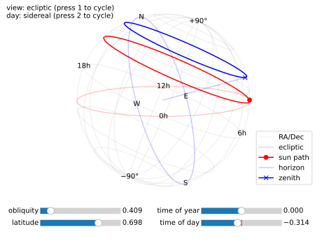
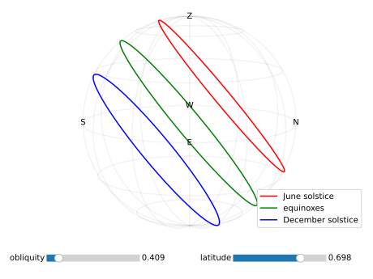
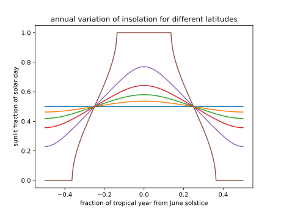
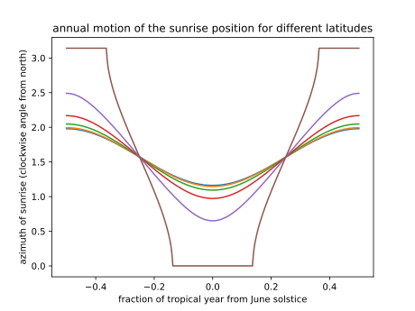

The Python script `celesph.py` creates an interactive visualization of how the celestial sphere according to an observer on a planet's surface changes with the planet's obliquity, the observer's latitude, the time of year, and the time of day.

The Python script `sunpath.py` plots the sun's trajectory on the sky over a day, the amount of insolation, and the sunrise position as functions of the observer's latitude and the time of year.

